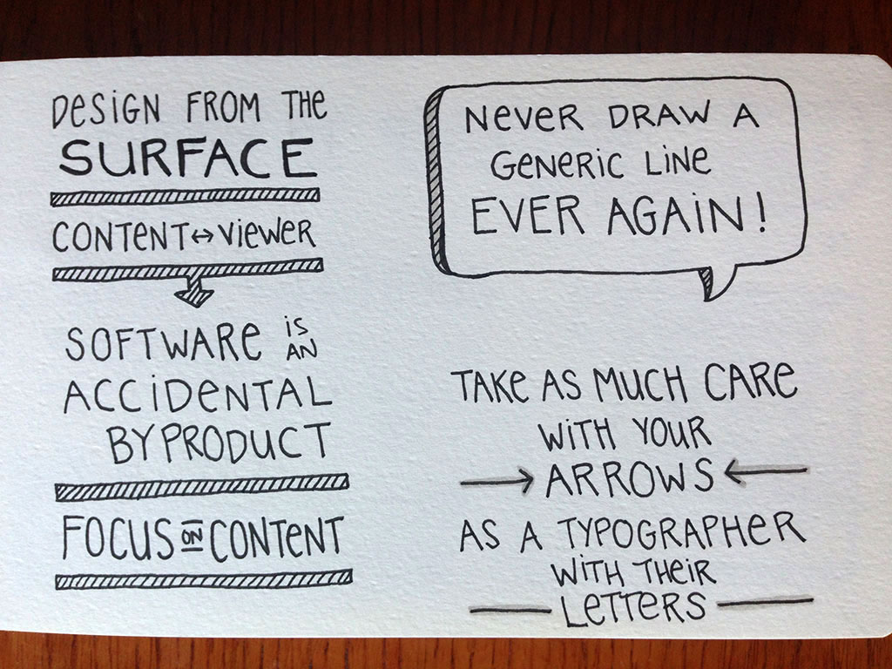
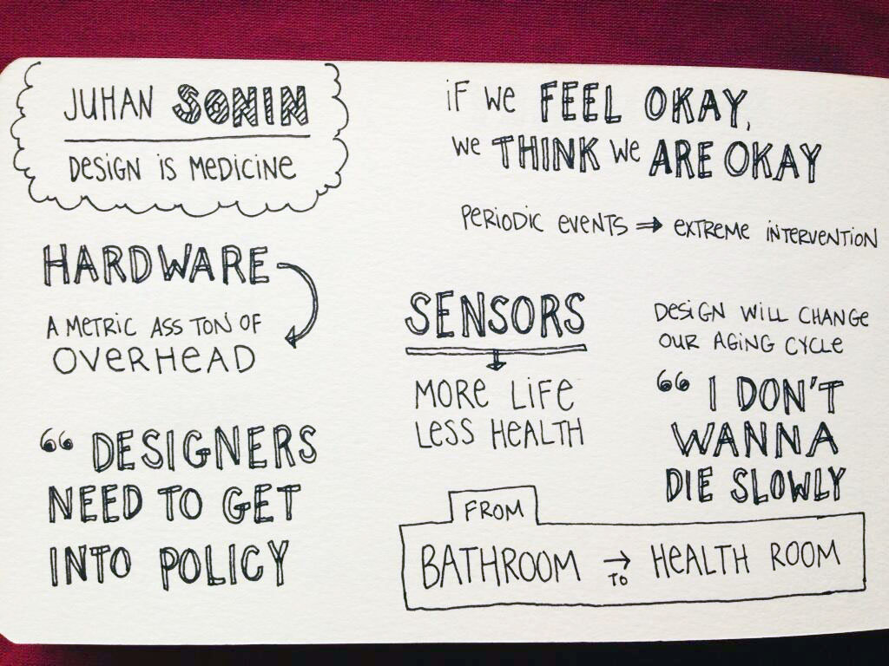
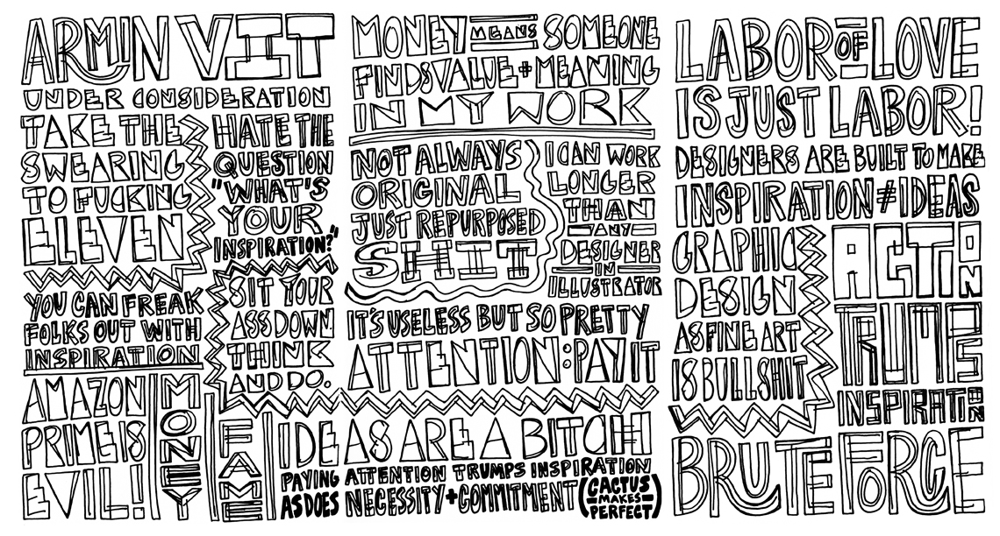
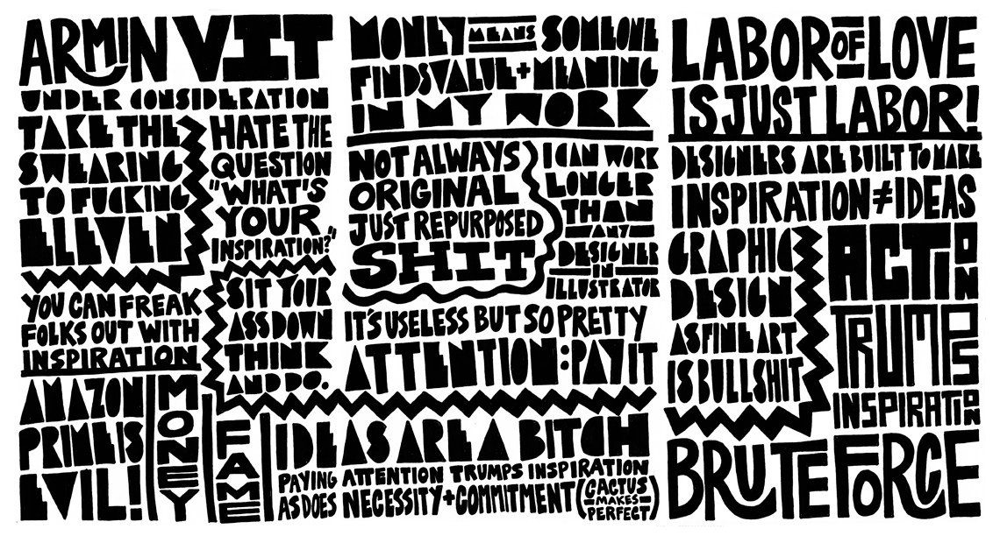

A few weeks ago, I wrote a post about [learning and comprehension](http://una.github.io/comprehension), and referenced some data, including this really great [TED Talk](http://www.ted.com/talks/sunni_brown#t-213976) on how studies show that doodling helps with creative thinking. As an extension of that, let's talk about sketchnotes. Sketchnotes are essentially a more creative form of note-taking, and can adopt a few different forms. I asked some pretty rad ladies about their sketch-noting techniques.

## Jess Eldredge

<em><a href="http://jessica-eldredge.com/">Jess</a> is a designer and front end developer, formerly of LivingSocial and Shopify, and currently preparing to travel the world.</em>

I mostly sketchnote presentations, though I’ve been recently exploring books as sketchnoting inspiration as well. I usually sketchnote live, at the same time as as I am consuming the content for the first time. I usually keep a small notepad with me to jot down concepts that I can’t capture into my sketchbook fast enough; it also helps me to spell words correctly before capturing them in my sketchnotes.

<a class="twitter-share left quote">I like to listen for quotable moments—things that get me nodding along, or things that make me laugh.</a>

I keep an eye on the clock and try to plan my page accordingly &mdash; I aim to have at least half the page filled up by the halfway point of the talk. If I’m behind, I’ll start writing with larger letters, or look to my notepad to see if there are other concepts I can add.

Before a presentation, I make sure to write down the title and the name of the presenter. I also spend a few moments before the talk looking up the presenter’s Twitter user name, if they have one. I like including this bit of information in the sketchnotes as well; this way I can quickly tweet after the presentation and make sure the presenter is tagged.

<figure class="right">

<figcaption>Jess' sketchnotes from Railsconf 2013</figcaption>
</figure>

My sketchnotes consist mostly of lettering and basic shapes like boxes and clouds—I’m still trying to push myself to incorporate more imagery and iconography into my notes! I really like using arrows, because they make my notes feel like a bit more like a <strong>mind-mapping</strong> exercise. I also like to put some emphasis into particular words that stand out to me in quotes by drawing them in a different style.

One of my favorite parts of sketchnoting is trying out notebooks and pens! I’m pretty loyal to <a href="http://www.moleskine.com/us/">Moleskine</a>, but I bounce back and forth between the traditional portrait-oriented sketchbook and the reporter-style sketchbook (which I turn sideways so I can draw in “landscape” mode). My latest pen obsession is the Uniball <a href="http://www.amazon.com/uni-ball-Retractable-Translucent-12-Pack-33950/dp/B000FDR47E">Signo retractable gel pen</a>…it glides perfectly on the page and still gives me a nice bold line. I also like to add a bit of shading to my notes with <a href="http://www.fabercastell.com/art-and-graphic/artist-products/pitt-artist-pens" >Faber Castell Pitt artist pen</a>.

Jess' sketchnotes from Edward Tufte Workshop 2013

Jess' sketchnotes from Edward Tufte Workshop 2013

## Carolyn Sewell
<em><a href="http://www.carolynsewell.com/">Carolyn</a> is a fabulous typographer, doodler, and designer. She is a glitter queen currently residing in and working from Washington DC.</em>

She has a really unique approach to sketchnoting that follows her illustration style. She outlines her 3-step process:

### Step 1: Skeletal

First I take skeletal notes during the actual talk, listening for quotable phrases, writing them as quickly as possible, and making sure to leave plenty of wiggle room.

### Step 2: Bulking

Once [I get] home, and usually during an NCIS marathon, I start bulking up the layout, adding structure to the words and symbols.

### Step 3: Filling

 Then I fill in everything (I go through a lot of ink at this point), scan it in and clean up.

## My Approach

The approach that I trend toward is one similar to Jess' in the sense that I create the sketchnotes on the spot at the event. I like to include a few more visual drawings to my sketchnotes, mixing typography and little doodles to illustrate a point. These little doodles are great tools for filling up empty space.

The beauty of sketchnoting is that there are no limitations or rules. Just build up your notes the way you feel most comfortable. Post links to your sketchnotes in the comments!

