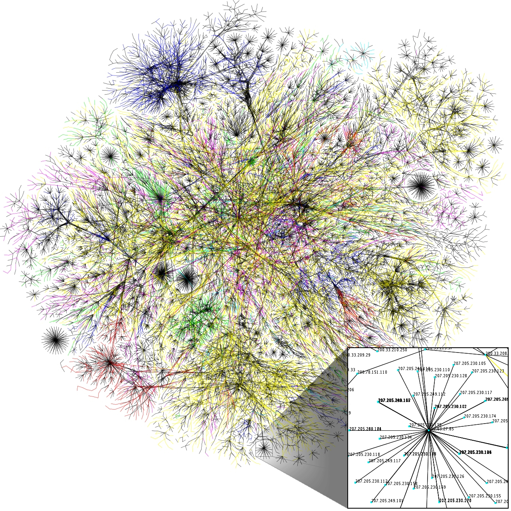

The Internet we know today is built on hacks. All of the newest trends that have come out have been based on workarounds of the past. Let's start by taking a look at the past.

## The Anchor Tag

It all started with the birth of the World Wide Web in 1989, which was based on a single, simple, yet extremely powerful building block of the internet: the anchor tag. Tim Berners Lee wrote a paper at CERN called "Information Management: A Proposal," in which he outlined an ever-evolving pool of information &mdash; "a universal linked information system" where "generality and portability are more important than fancy graphics techniques and complex extra facilities. [1](http://www.independent.co.uk/life-style/gadgets-and-tech/news/25-years-of-the-world-wide-web-the-inventor-of-the-web-tim-bernerslee-explains-how-it-all-began-9185040.html)"

That, in a nutshell, is why the web was created. It was a system of information sharing and linking, leading users to be able to connect between documents and share content. Simple content sharing and information transfer.

An image from the [Opte Project](http://www.opte.org/), which visualizes Internet connections.

But we wanted those fancy graphics techniques and complex add-ons. And yet, all we really had was basic HTML that you couldn't even nest that deep. But we also had an anchor tag and this idea of a link.

The <a href="http://www.w3.org/MarkUp/draft-ietf-iiir-html-01.txt">HTML 1.0 Draft Spec</a> (it's super interesting &mdash; highly recommend giving it a read!

This link has become the basis of the web. Seriously. If you think about it, everything is a link: from images to CSS styles to scripts. They are all links.

<ul>
  <li> Images: <code>&lt;img src="&lt;LINK&gt;"&gt;</code></li>
  <li> Styles: <code>&lt;link href="&lt;LINK&gt;"&gt;</code></li>
  <li> Scripts: <code>&lt;script src="&lt;LINK&gt;"&gt;</code></li>
</ul>

These have become the building blocks of the web today.

## HTTP2

Because the proliferation of links we now inject into each and every web page, we've needed to come up with faster and better mechanisms. Enter: HTTP2. I am not going to pretend to know everything about this new transfer protocol, but the important thing to know is that is will speed up header requests, and will specifically improve speed of multiple threads of data being served at the same time. AKA, with multithreading, it will be more performant to send multiple script files instead of concatenating all of your scripts into one large file since they won't each be individual blocking requests.

## Lets Talk About CSS

### Flexbox

### Blurred Backgrounds

-> fixed/cover/background hack
-> now backdrop-filters

Now with `backdrop-filter` which just *dropped* a few days [ago](https://www.webkit.org/blog/3632/introducing-backdrop-filters/) (sorry i'm not sorry about that pun), this hack will become reality! http://caniuse.com/#feat=css-backdrop-filter

## Javascript

All of Javascript is a hack. Patterns, things like classes now being available in ES6

## Conclusion

All we can really do is keep building. Complain on Twitter, figure out a hack to fix it, then submit a proposal to the W3C and make change. Everything we build is a hack. But those hacks have become the cornerstones of what the internet is (or is becoming). It's a **great** thing. We, as a collective audience and user base of the web are paving the cowpaths of this thing we are building together instead of leaving it to a committee forging a plan in stone. The web is a democracy! And this is evident for anybody who has ever worked in product design.

People will start doing things you don't expect them to, and using your product in unintended ways (I use Snapchat to check the weather). Instead of fighting users and re-directing them, embrace it! This is how innovations are created and then standards are built from those innovations. Right now, there is begining to be talk a
